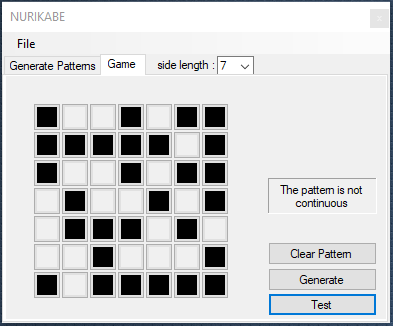
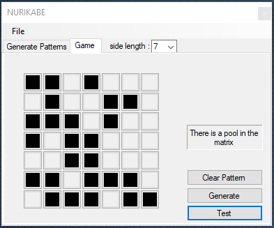
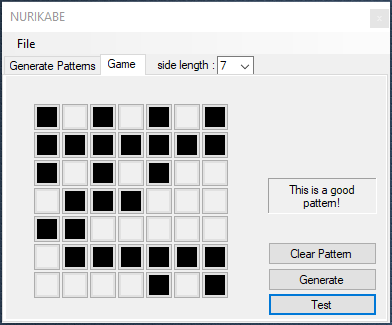

# What is this?
This repository contains the findings of the research that was conducted by students at Missouri Southern State University.

**Students**: [Jonas Smith](https://github.com/JonasESmith), [Jaired Collins](https://github.com/jairedcollins), and [Andrew Robinson](https://github.com/SirArkimedes)

**Advisors**: Dr. Charles Curtis and Dr. Jacob Boswell

# NURIKABE
Applications to test all possible legal patterns for a [n,n] Nurikabe grid.

<h2> Rules </h2>
	<h4> 1. Water (black squares) must be continuous </h4>
		
	<h4> 2. Cannot have pools of water </h4>
		
	<h4> 3. Good pattern </h4>
		

# Solutions
* Brute force
  * A low level approach
  * considers all possible solutions when testing pattern
* Pruning
  * Attempts to prune bad patterns early
  * With large [n x n] prunes nearly 99% of patterns

## Solution Results

    ( Updated 10/29/2019 ) - Added results for 7x7

  | N   | Good patterns | Equiv Classes | Prune (s) | Brute (s)        |
  | :-: | :---         | :------------- | :------- | :-------------- |
  |2x2  | 13            |             4 | ~         |  ~               |
  |3x3  | 140           |            31 | ~         |  ~               |
  |4x4  | 3,756         |           497 | ~         |  ~               |
  |5x5  | 318,890       |        38,858 | 1.209     |  1.157           |
  |6x6  | 84,900,755    |               | 67.439    |  2,226.417       |
  |7x7  | 1,807,325,349 |               | 78,963.73 |  N/A             |
              							
              
              
    

  ## Solution Results for islands of size one

    ( updated 10/29/19 )  - using rows that only use islands of size 1

  * The idea for these results is to use rows to construct the puzzles like this for a 4x4 row `{ 0, 1, 0, 1 }` where island size cannot be greater than one.

| n  | Patterns     | Time in (ms)                | recursive method calls | possible patterns (2^n^2) |
| -  | --------     | --------------------------- | ---------------------- | ------------------------- |
| 2  |4             | ~                           | 9                      | 16                        |
| 3  |12            | ~                           | 49                     | 512                       |
| 4  |46            | ~                           | 368                    | 65,536                    |
| 5  |302           | ~                           | 4,573                  | 33,554,432                |
| 6  |2800          | ~                           | 90,821                 | 68,719,476,736            |
| 7  |39236         | 169                         | 2,993,954              | 562,949,953,421,312       |
| 8  |800030        | 6,861                       | 159,103,215            | 18,446,744,073,709,551,616|
| 9  |23,892,610    | 535,480                     | 418,244,822            | 2^81                      |
| 10 |1,036,381,448 | 62,935,121 (17.5 hours)     | ** (stopped recording) | 2^100                     |
